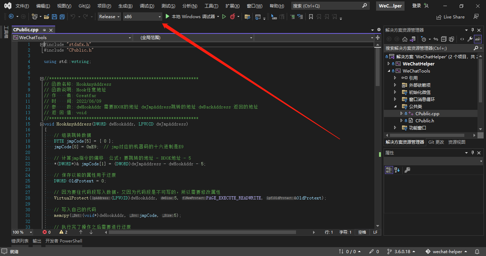
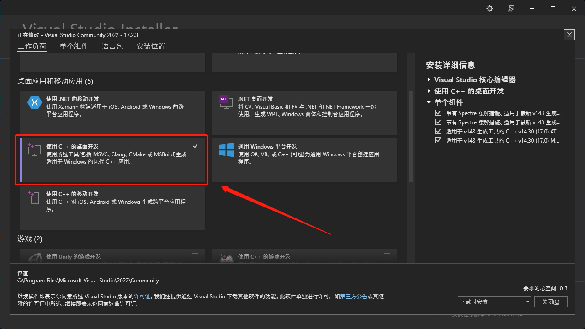
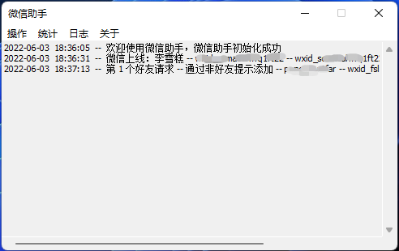

## 前言

* 微信助手（微信加粉计数器），把客服加好友信息传到服务器，用于统计加粉数量，对客服微信进行监管（防止客服跳单）

* 当前适配 [微信 for windows 3.2.1.154](https://pc.weixin.qq.com/)

## 项目简介

* 编译环境为 [Visual Studio 2022](https://visualstudio.microsoft.com/zh-hans/) ， Visual Studio 2017 以上也可以（根据VS打开时的提示切换SDK依赖，或安装对应的 [Windows SDK 10.0.19041.0](https://developer.microsoft.com/zh-cn/windows/downloads/sdk-archive/) )

* WeChatHelper.exe 为 [MFC 桌面应用程序](https://docs.microsoft.com/zh-cn/cpp/mfc/mfc-desktop-applications?view=msvc-170) , 需要在安装 `visual studio` 时，勾选MFC（可选安装项），或者在安装VS后，使用 `Visual Studio Installer` 安装 `适用于 v143 生成工具的 c++ 14.30 (17.0) MFC`

* `微信 for windows 3.6.0.18` 下载链接（复制到浏览器打开）：[http://file.greatfar.cn/down/HSdyx2rDrL0y](http://file.greatfar.cn/down/HSdyx2rDrL0y)

* 网络请求基于 [libcurl 7.83.1](https://curl.se/)

* JSON解析基于 [Tencent/rapidjson](https://github.com/Tencent/rapidjson/)

* 本解决方案，包含2个project（WeChatHelper 和 WeChatTools）
> WeChatHelper 为MFC窗口程序，负责提供用户操作界面。
 WeChatTools 为 Win32 DLL 工程，最终编译成 WeChatTools.dll ，由 WeChatHelper.exe 把它注入到微信进程， 对 微信 for windows 进行 HOOK 操作。

* WeChatHelper.exe 和 WeChatTools.dll 之间采用 [WM_COPYDATA](https://docs.microsoft.com/zh-cn/cpp/mfc/reference/cwnd-class?view=msvc-170#oncopydata) 的方式（windows message 消息机制）进行进程间通讯。

* 由于使用了内联汇编，`debug` 和 `release` 都需要使用 `x86` 模式进行编译，不要使用 `x64`，否则会报错 `使用了非标准扩展不支持在此结构上使用_asm关键字`

* 运行环境，Visual C++ 桌面开发

## 效果演示

将 WeChatHelper.exe 、 WeChatTools.dll 、libcurl.dll 、config.ini 放在同一个目录下，打开 WeChatHelper.exe 会自动唤起微信，登录微信即可

## 声明

**本项目仅供技术研究，请勿用于非法用途，如有任何人利用此项目做非法事情，均与作者无关，特此声明**
